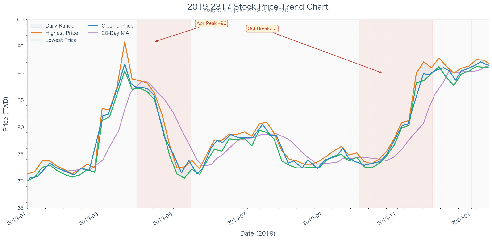
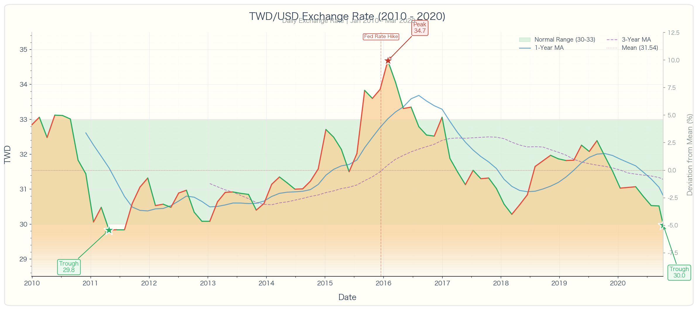
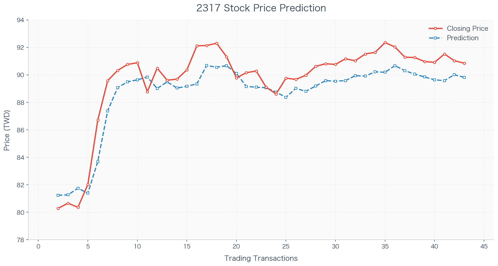
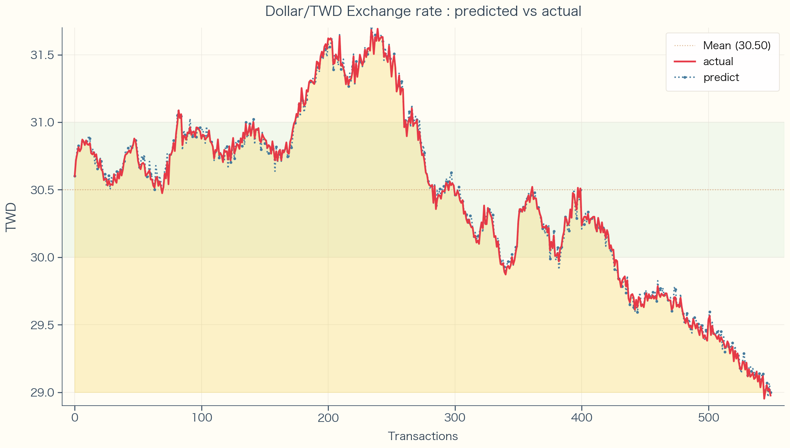

# Stock-FX-Tracking-and-Prediction
This repository presents the methodology and results of a stock and FX prediction project.

# Stock & FX Tracking and Prediction

*A case study in time-series modeling for financial markets*

## Overview

This project builds models to track and predict stock prices and exchange rates. The focus is on capturing trends and evaluating prediction accuracy on unseen data.

Part of implementation details and code are publicly shared; this site presents the methodology, results, key figures, and code .

## Data & Setup

- **Assets:** [e.g. stock 2317, USD/TWD exchange rate]
- **Period:** [e.g. daily trade transactions: 2019-2020 of 2317, 2010 - 2020 of USD/TWD Exchange Rate]
- **Split:** train/validation/prediction with chronological ordering

## Modeling Approach

The models use historical prices and derived features to forecast future values. The evaluation emphasizes:

- Ability to track major up/down moves in historical data

## Results: Tracking

**Stock price tracking.** The model follows the main trends in historical stock prices.

**Exchange rate tracking.** The model captures the broad movements in the FX rate.

## Results: Prediction vs. Actual

**Stock prediction vs. actual (test set).** The scatter shows how closely predicted prices align with realized prices on unseen data.

**FX prediction vs. actual (test set).** The model achieves reasonable alignment with actual exchange rates, with some under/over-prediction at extremes.

## Key Findings

-
- 
- 

## 

This is a demonstration site for a portfolio project.
